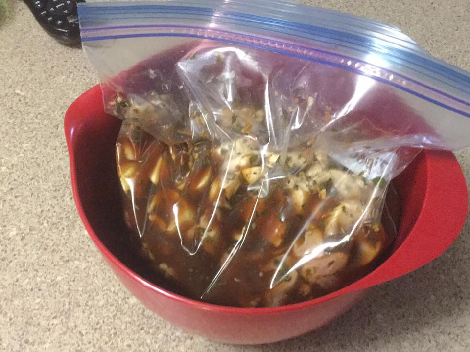
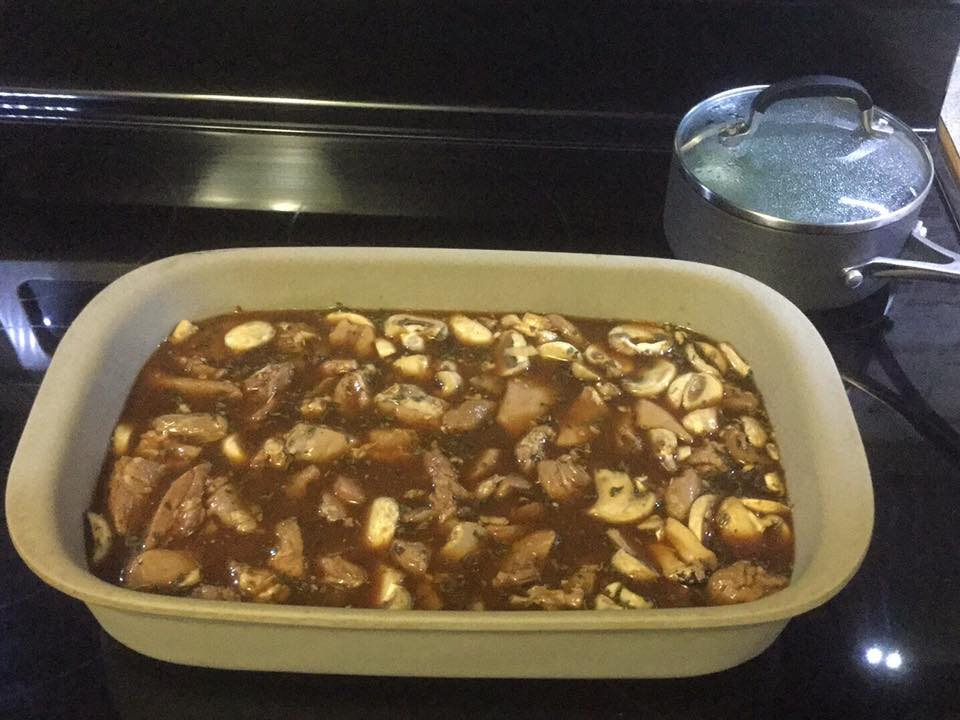
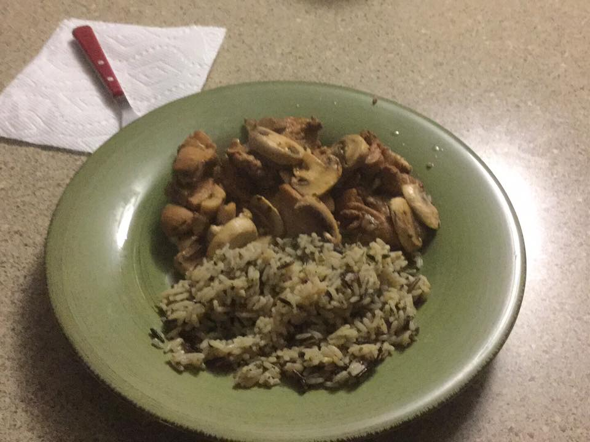

# Toxic Waste Chicken

*Not for sensitive stomachs.*

Spicy, garlicky, savory, and completely over the top — in the best possible way.
Dark meat stays juicy and takes the marinade beautifully.

---

## Ingredients

- 1 package boneless skinless chicken thighs
- Mushrooms (amount to taste)
- Italian seasoning
- Cayenne pepper — a bunch
- Minced garlic — a seriously obscene amount
- Soy sauce
- Lemon juice

---

## Marinade

Mix **3 parts soy sauce** to **1 part lemon juice** — enough to cover everything.
Target color: milk chocolate brown.

---

## Instructions

1. Trim most of the fat from the chicken thighs, cut into bite-size pieces.
2. Wash and slice mushrooms.
3. Add chicken and mushrooms to a gallon zip-lock bag.
4. Add Italian seasoning, cayenne, and garlic directly to the bag.
5. Inflate bag and seal, shake it up to distribute the spices all throughout the chicken and mushrooms.
6. Pour in the soy sauce / lemon juice mixture until chicken and mushrooms are covered.
   The marinade in the bag should be close to a milk chocolate color.
7. Expel all air from the bag and seal.

8. Marinate in the refrigerator for a couple of hours.
9. Pour entire contents of bag (liquid included) into a 9×13 casserole dish.
   Chicken and mushrooms should be mostly submerged.
10. Bake at **325°F for about 30 minutes**.

11. Serve over rice.

---

## Notes

- Uncle Ben's is preferred; minute rice also works — use whatever you like.
- It's yummy, if a little over the top on the spicy side.
- Don't go light on the garlic. Seriously.

<!-- SN: 00003 -->
